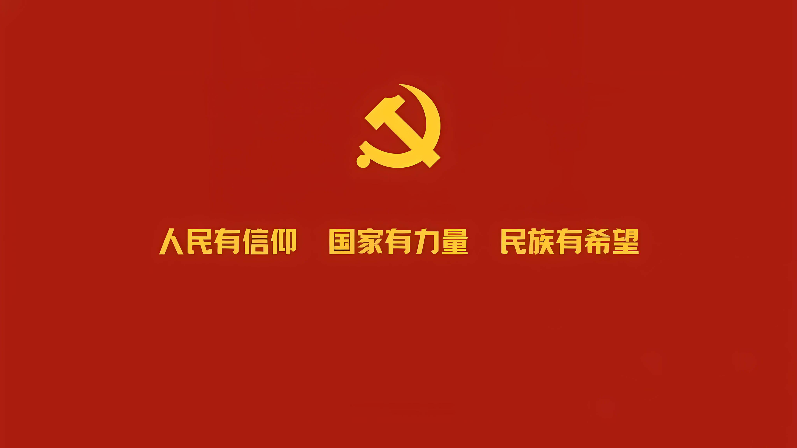

```markdown
# 传承红色基因，争做时代新人




---

###  信仰的光芒

党徽，是信仰的图腾，是初心的象征。那闪耀的金色，不仅代表着光辉的历程，更指引着未来的方向。作为新时代的接班人，我们生在红旗下，长在春风里，目光所至皆为华夏，五星闪耀皆为信仰。

###  我们的使命

“我们是共产主义接班人，继承革命先辈的光荣传统。”这不仅是一句歌词，更是我们肩上的责任。

- **铭记历史**：不忘来时路，方知向何行。
- **勤奋学习**：用知识武装头脑，用科技建设祖国。
- **砥砺前行**：在困难面前不低头，在挑战面前不退缩。

> 少年强则国强，少年进步则国进步。让我们接过历史的接力棒，以青春之我，创建青春之国家，青春之民族。

---

**不忘初心，牢记使命，做合格的共产主义接班人！**
```

### 方式二：HTML 标签语法（支持居中与调整大小）

如果你希望图片在文章中**居中显示**，或者需要**调整图片大小**，可以使用这种 HTML 标签的方式。

```markdown
# 传承红色基因，争做时代新人

<div align="center">
  
  <br>
  <em>图：闪耀的党徽指引我们前行</em>
</div>

---

###  信仰的光芒

党徽，是信仰的图腾，是初心的象征。那闪耀的金色，不仅代表着光辉的历程，更指引着未来的方向。作为新时代的接班人，我们生在红旗下，长在春风里，目光所至皆为华夏，五星闪耀皆为信仰。

###  我们的使命

“我们是共产主义接班人，继承革命先辈的光荣传统。”这不仅是一句歌词，更是我们肩上的责任。

- **铭记历史**：不忘来时路，方知向何行。
- **勤奋学习**：用知识武装头脑，用科技建设祖国。
- **砥砺前行**：在困难面前不低头，在挑战面前不退缩。

> 少年强则国强，少年进步则国进步。让我们接过历史的接力棒，以青春之我，创建青春之国家，青春之民族。

---

**不忘初心，牢记使命，做合格的共产主义接班人！**
```

